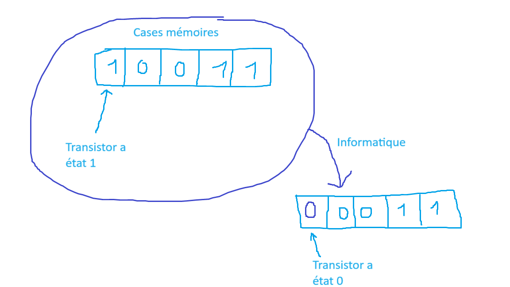
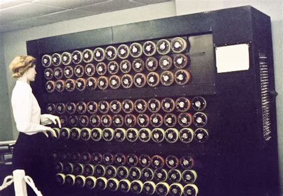
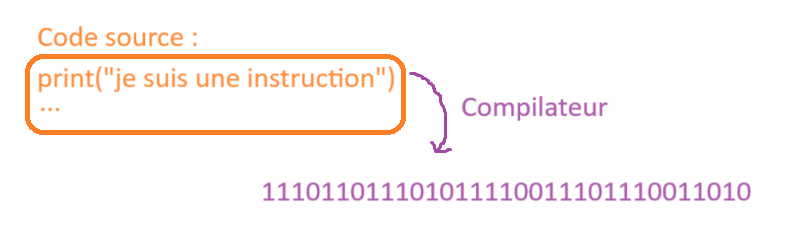
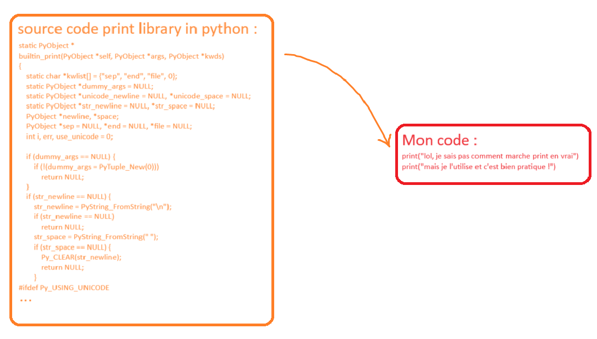

# C'est quoi l'informatique ?

J'ai de maigre connaissance en la matière alors même que j'en suis le premier utilisateur. Néanmoins je me tente à l'exercice afin de voir évoluer ma conception de ma discipline au fil des années. **Vous pourriez vous aussi écrire sur votre discipline, ce serait amusant.** 

L'informatique, c'est la **science du traitement de l'information**. Toutes les informations en informatique binaire (nous ne parlerons pas de l'informatique quantique) sont stockées sous la forme d'une **suite de 0 et de 1**. Un **transistor** est composant électronique de **quelques nanomètres** qui a deux états différents (nommé 0 ou 1 pour simplifier). Le travail de l'informaticien est de gérer les passages de 0 à 1 ou de bien de 1 à 0 des transistors d'un ordinateur afin d'effectuer une action spécifique. Bien entendu, après des décennies de recherches et d'innovations, tout est devenu bien plus abstrait et aucun informaticien ou presque n'interragit directement avec des transistors.



*schéma kawaii réprésentant une transmission de donnée*

L'informatique, ce n'est pas de l'électronique. L'électronique est indispensable à l'informatique autant que les maths sont indispensables à la physique, mais ces deux disciplines n'ont rien à voir. Ne demandez donc pas à un informaticien de réparer votre écran, ce n'est pas son métier. 

Si aux débuts de l'informatique, la mécanique et l'électronique faisait partie intégrante du processus de création logiciel, aujourd'hui nous en sommes à un tel niveau d'abstraction qu'on ne crée plus de matériel pour un usage logiciel spécififique, mais qu'on crée des logiciels directement dans un autre logiciel et non plus dans le monde physique. La seule interraction physique que vous aurez avec votre machine, c'est votre clavier retro-éclairé-rgb.
Par exemple la bombe de turing restait encore compréhensible par un être humain d'un point de vue mécanique, ce qui n'est plus le cas sur les machines informatiques actuelles. 



*la machine à Turing*


Tous les développeurs informatiques utilisent des langages de programmation pour gérer le stockage et la transmissions des informations dans les transistors d'un pc (personnal computer = ordinateur personnel). Mais qu'est-ce que c'est ? Un langage de programmation, c'est une abstraction, à vrai dire, l'entièreté de l'informatique est une abstraction, car changer un 0 en 1 ne veut rien dire de spécial pour un être humain, mais changer la variable `animal = chien` en `animal = oiseau` devient tout de suite bien plus compréhensible. Un langage de programmation sert à sauvegarder un ensemble d'instructions compréhensibles par un être humain dans ce qu'on appelle un code source. 
ex :
```py
#je suis en langage python
a = 1
print("ceci est un message écrit dans la console (endroit ou est écrit ce que fait notre programme)")
print("un programme est une séquences d'instructions")
print("cette ligne est une instruction")
print("chaque instruction est éxécutée au lancement du programme l'une à la suite de l'autre")
a  = a+1
print("a = 2 maintenant")
```
Il existe nombre de langages différents car chaque abstraction créée en informatique a ses faiblesses et points forts, même les langages écrits pour faire de l'informatique ! Il y a des langages plus simples, rapides, plus propre syntaxiquement, etc... Mais comment on passe de phrases humaines à un exécutable inbitable par l'homme mais parfait pour la machine ? Eh bien, on va se servir d'un **compilateur**. Un compilateur va convertir ton code source (suite de phrases compréhensibles par l'homme) en un exécutable en code machine. Et pour vous casser le cerveau, sachez que pour inventer un nouveau langage a, il faut naturellement créer son compilateur dans un autre langage b déjà existant, et ce n'est qu'une fois le langage a finalisé qu'on peut se permettre de réécrire le compilateur du langage a dans le langage a lui même !



*d'instruction compréhensible à la machine*

Enfin, même si vous demandez à un informaticien de débugger votre logiciel de traitement de texte favori, ce qu'il est censé pouvoir faire en théorie, il est peu probable qu'il accepte. Car l'informatique aujourd'hui utilise ce qu'on appelle des **library**. Une library c'est un livre contenant du code écrit par un autre informaticien. Par exemple, la library `print` en python (comme vous l'avez vu précédement) permet d'écrire une nouvelle ligne sans avoir besoin de le coder soit même (ce qui est un bordel monstre sachez-le). Et il existe une quantité monstrueuses de library pour les usages les plus variés. Un informaticien digne de ce nom ne saura jamais vous expliquer facilement sur quoi il travaille étant donné que son métier du moment est très souvent basé sur des library **ultra spécialisées**. Voilà poourquoi l'informatique est aussi diverse, car lorsqu'on parle d'un domaine aussi vaste que le traitement de l'information dans un monde ultra connecté, le nombre de spécialisations existantes, disparues et à venir est incommensurable.



*schéma, d'utilisation d'une library*

En conclusion, l'informatique c'est une supperposition de multiples abstractions pour donner un sens aux déplacements et stockages de 0 et de 1, et putain on peut en faire des choses avec un concept aussi simple ! On pourrait se dire que tout est bien complexe et que ce n'est pas accessible, mais ce serait oublié une chose essentielle, il n'est pas important de tout comprendre en informatique. Les libraries créées au fil des années sont là pour vous aider, la programmation en bloc est intuitive et parfaite pour les débutants et enfin l'informatique ce n'est rien de plus d'une suite d'instructions, comme une recette pour faire un gâteau. Tout le monde en est capable, même si passé un certain point la courbe d'apprentissage devient assez dur je dois vous l'admettre.

*J'espère que ce post aura contribué à démistifier l'informatique dans vos cerveaux magiques, bonne journée uwu*